# Kyiv venue guide web platform

This project provides a simple and effective way to browse city venues, check their menus, and handle table reservations through a single interface.

Built a full-stack MVC web application for managing and exploring city venues, demonstrating CRUD operations, form validation, and clean separation of concerns between application layers.

### Technical overview
* Developed backend logic and data handling using ASP.NET MVC
* Implemented full CRUD functionality with server-side validation
* Designed responsive UI with HTML, CSS, and JavaScript
* Database: SQL Server (Entity Framework)

### Project screenshots

#### 1. Venue explorer
Main dashboard for browsing and viewing venue details.
* Main list: 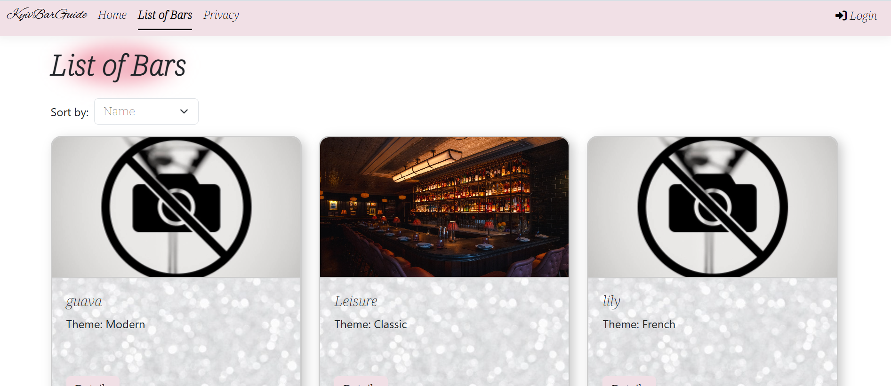
* Venue page: 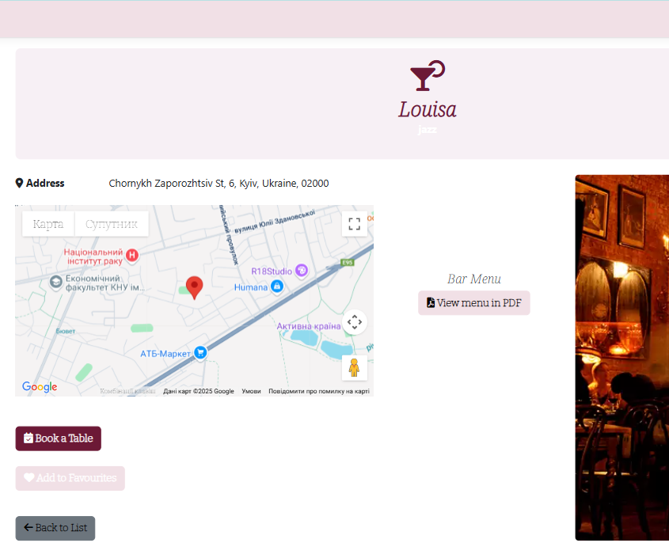
* Menu details: 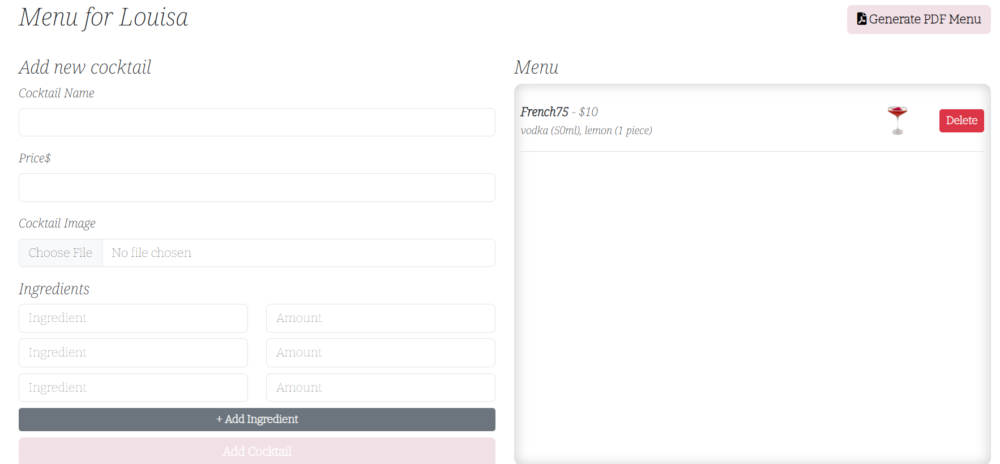
* Maps integration: 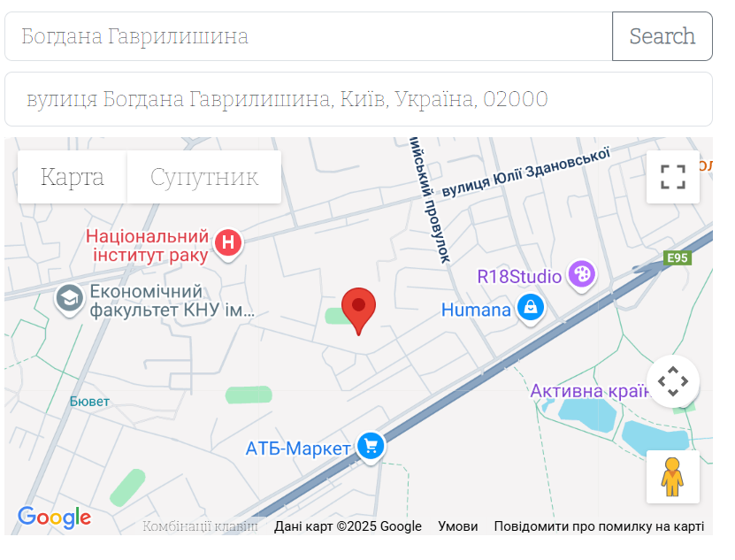

#### 2. Authentication and user profiles
Secure login flow and personalized user features.
* Login page: 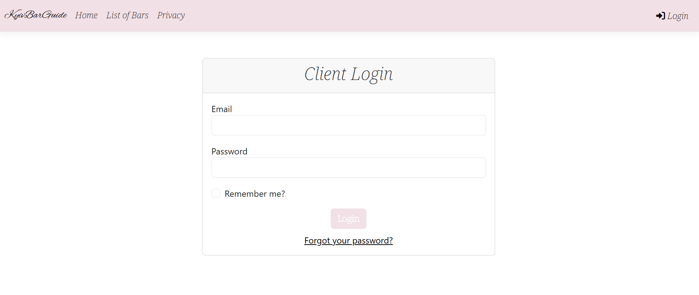
* Authorization: 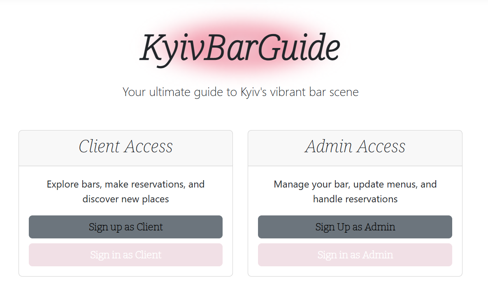
* Favorites list: 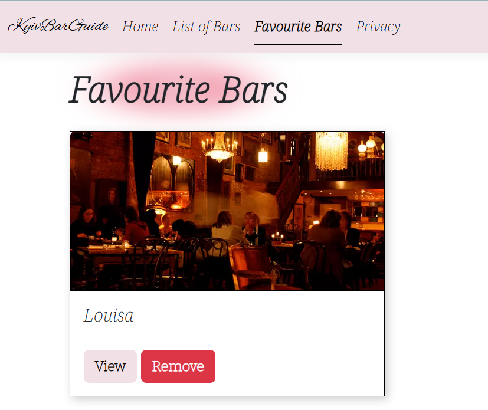
* Password recovery: 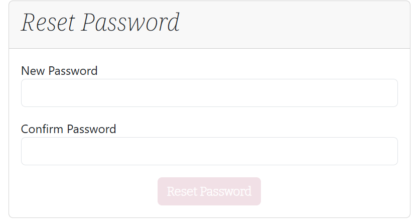
* Reset confirmation: 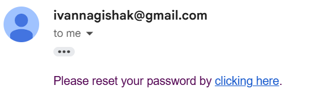

#### 3. Reservation system
Complete booking flow with automated status updates.
* Booking interface: 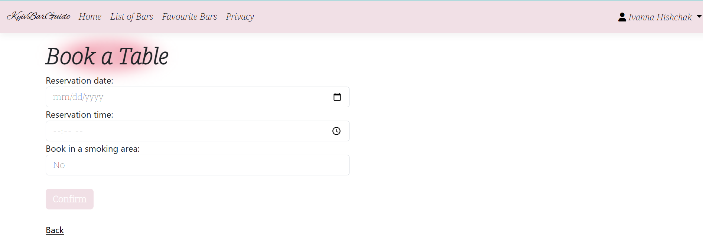
* Logic handler: 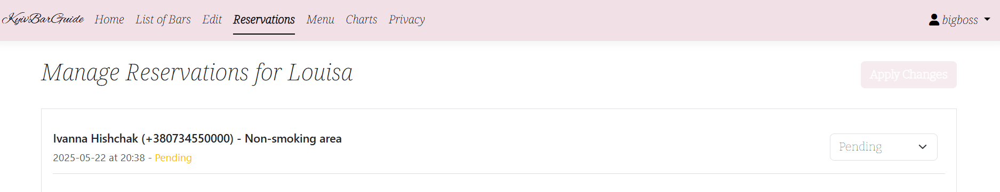
* Confirmation message: 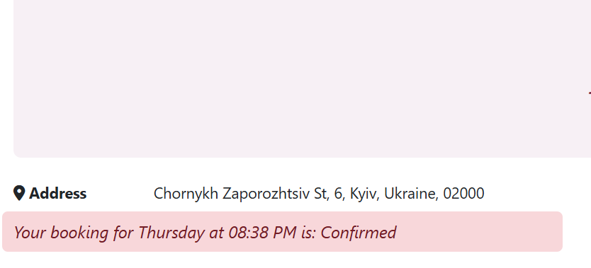

#### 4. Administration and data management
Tools for managing content and exporting reports.
* Edit venue info: 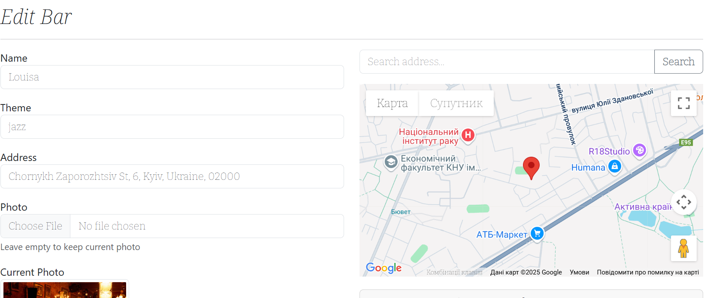
* Content management: 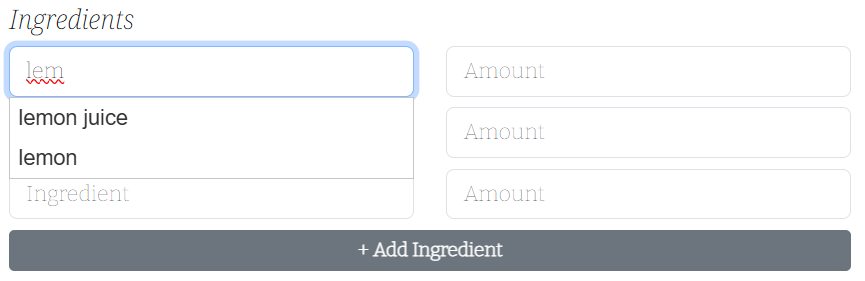
* Export tool: 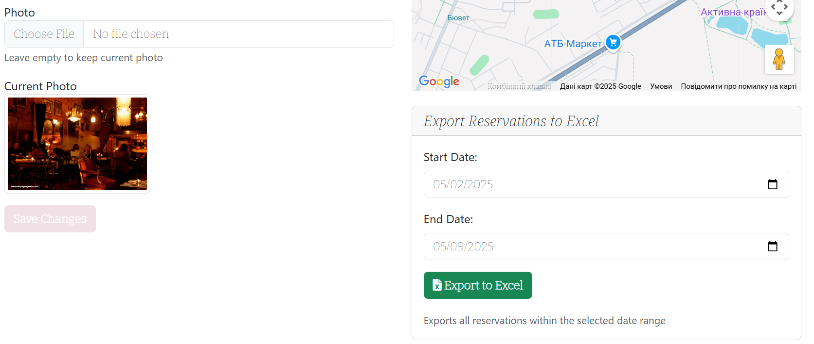
